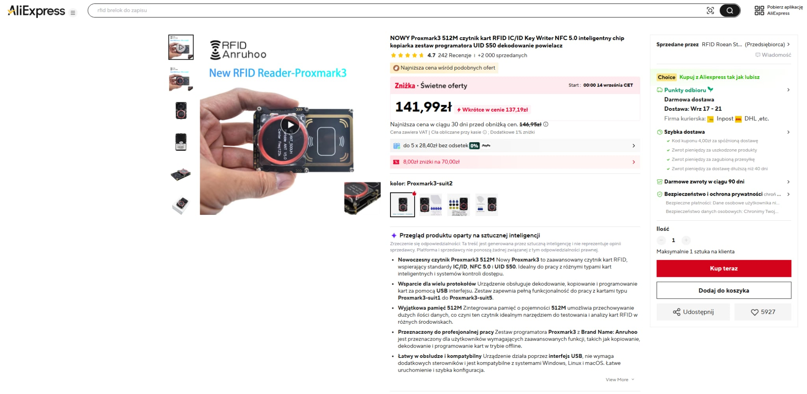
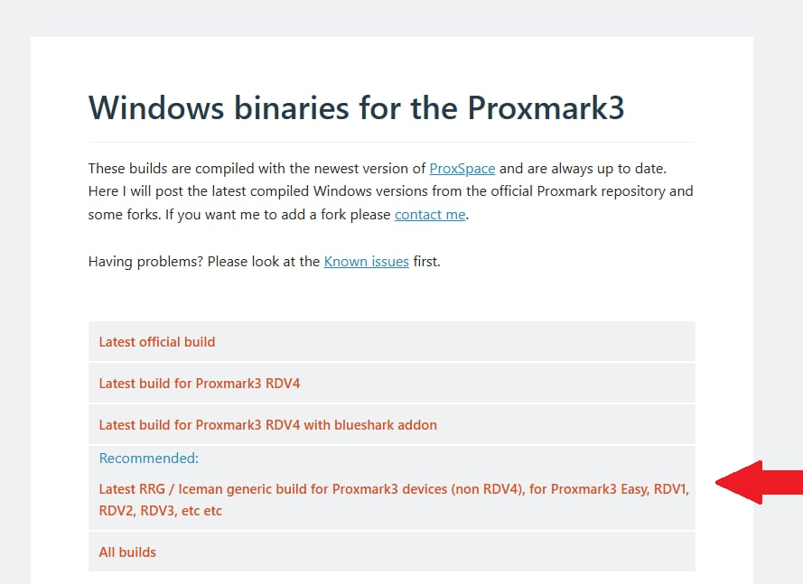
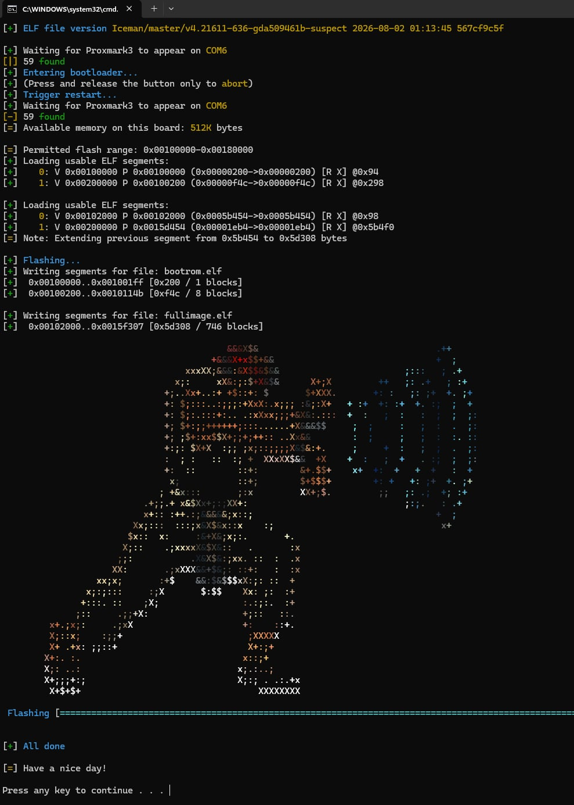
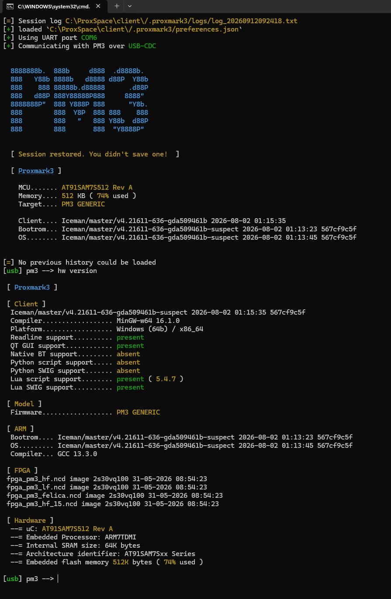
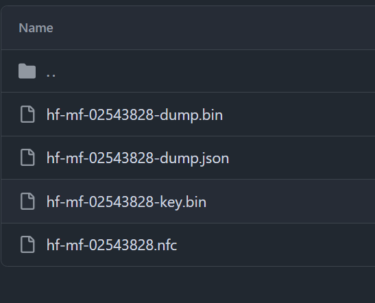
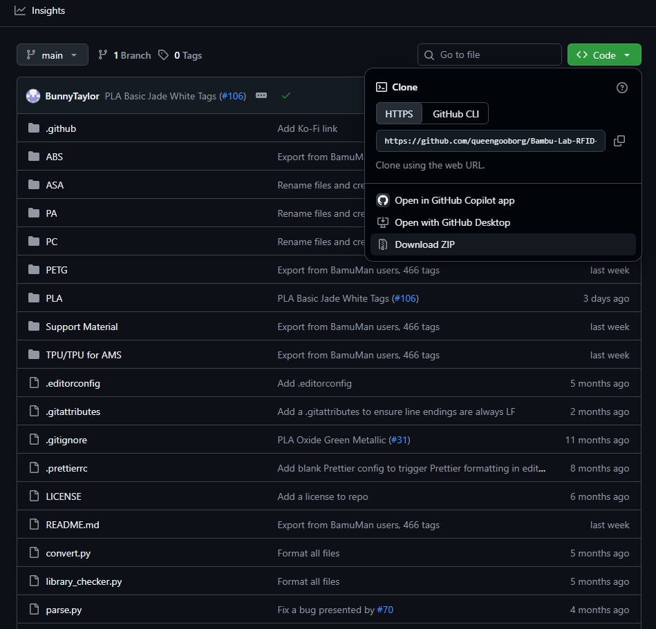
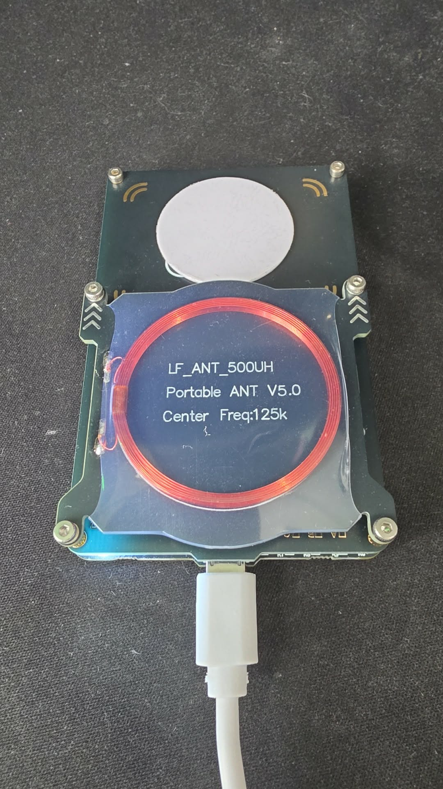
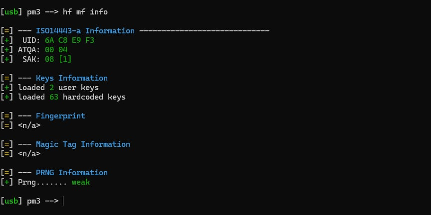

# Programowanie tagów RFID Bambu Lab na tagach UFUID i FUID

Prosta instrukcja "krok po kroku" jak zrobić własne tagi RFID, które drukarka Bambu Lab / AMS rozpozna jako oryginalny filament. Napisana z myślą o osobach, które nigdy wcześniej nie miały do czynienia z Proxmarkiem ani RFID.

To jest skrócona wersja dwóch oryginalnych projektów — jeśli czegoś tu zabraknie, szukaj tam:

- **Zrzuty tagów (dane do zapisu)** — [Bambu-Lab-RFID-Library](https://github.com/queengooborg/Bambu-Lab-RFID-Library) — baza plików, które ludzie zgrali z oryginalnych szpul i wrzucili na GitHub. Jest ich pełno, posegregowane wg materiału → wariantu → koloru.
- **Pełna instrukcja zapisu** — [Bambu-Lab-RFID-Tag-Guide → WriteTags.md](https://github.com/queengooborg/Bambu-Lab-RFID-Tag-Guide/blob/main/docs/WriteTags.md) — pokazuje jak programować różne typy tagów. Ta instrukcja to skrót ograniczony do **dwóch przetestowanych typów tagów: UFUID i FUID** (sekcje Gen 4 na tamtej stronie).

---

## Spis treści

1. [Co kupić](#1-co-kupić)
2. [Instalacja programatora Proxmark3 (Windows)](#2-instalacja-programatora-proxmark3-windows)
3. [Pobranie pliku z danymi filamentu](#3-pobranie-pliku-z-danymi-filamentu)
4. [Programowanie tagu](#4-programowanie-tagu)
5. [Zapieczętowanie tagu UFUID (obowiązkowe dla UFUID!)](#5-zapieczętowanie-tagu-ufuid-obowiązkowe-dla-ufuid)
6. [Montaż na szpuli](#6-montaż-na-szpuli)
7. [Najczęstsze problemy](#7-najczęstsze-problemy)
8. [Źródła i podziękowania](#8-źródła-i-podziękowania)

---

## 1. Co kupić

### Programator — Proxmark3

- **Co:** programator RFID **Proxmark3** (najczęściej spotykana wersja to "Proxmark3 Easy").
- **Gdzie:** AliExpress — wpisz w wyszukiwarkę `proxmark3`.
- **Cena:** ok. **120–150 zł**.
- **Na co uważać przy zakupie:**
  - Wybierz wersję z pamięcią **512 KB** (procesor `AT91SAM7S512`). Część tańszych egzemplarzy ma tylko 256 KB i **nie da się na nie wgrać** nowoczesnego oprogramowania Iceman, które jest potrzebne w tej instrukcji. Jeśli w opisie aukcji nie ma informacji o pamięci, zapytaj sprzedawcę lub wybierz ofertę, która wyraźnie pisze "512K".
  - W zestawie powinien być kabel USB. Wygląda to jak dwie płytki (anteny) złożone razem, z gniazdem USB z boku.

Przykładowa aukcja na AliExpress (wersja **512M**, ok. 140 zł):



### Tagi — dwa sprawdzone rodzaje

Przetestowane i działające w AMS są **dwa rodzaje** tagów. Wybierz jeden (albo oba — programuje się je prawie tak samo, różnica jest w jednym kroku).

**Opcja A — monety UFUID (neven7.eu)**

- **Co:** puste, zapisywalne tagi typu **Gen4 UFUID** z warstwą **anti-metal** (żeby działały przyklejone do szpuli / w pobliżu metalu).
- **Gdzie:** [neven7.eu — 30 mm UFUID RFID coin](https://www.neven7.eu/p/30mm-ufuid-rfid-coin)
  - *25 mm UFUID RFID token with Anti-Metal Layer | On-Metal Tag for Asset Tracking*
  - *30 mm white UFUID RFID coin, token with anti-metal layer for reliable tracking on metal surfaces*
- **Programowanie:** zapis + **obowiązkowe pieczętowanie** czterema komendami ([punkt 5](#5-zapieczętowanie-tagu-ufuid-obowiązkowe-dla-ufuid)).

**Opcja B — tagi FUID z AliExpress (tanie) ✅ potwierdzone, działają**

- **Co:** tagi typu **Gen4 FUID** — "jednorazowy UID, zapisywalny blok 0". Forma: brelok / token (bez zadeklarowanej warstwy anti-metal).
- **Gdzie:** AliExpress — [5 sztuk/partia FUID Tag jednorazowy UID zmienny blok 0 zapisywalny 13.56Mhz RFID zbliżeniowy piloty Token klucz kopiuj klon](https://a.aliexpress.com/_ExY0f1M)
- **Cena:** **poniżej 3 zł za sztukę** (sprzedawane po 5 szt. w partii).
- **Programowanie:** **jedna komenda** ([krok 4.2b](#krok-42b--tag-fuid-aliexpress)), **bez pieczętowania** — tag blokuje się sam po pierwszym zapisie.
- Sprawdzone w praktyce: zapisują się raz i **AMS je rozpoznaje**.

📷 *[tu zdjęcie: tag FUID z AliExpress (brelok)]*

| | **UFUID (neven7.eu)** | **FUID (AliExpress)** |
|---|---|---|
| Cena za sztukę | wyższa | poniżej 3 zł |
| Forma | moneta 25 / 30 mm, anti-metal | brelok / token |
| Ile razy da się zapisać | w praktyce **raz** (po zapieczętowaniu) | **raz** (blokuje się sam) |
| Pieczętowanie | **tak, obowiązkowe** (4 komendy) | **nie** |
| Komenda zapisu | `hf mf cload` | `hf mf restore --force` |
| Działa w AMS | ✅ | ✅ |

- **Ile:** jedna szpula = **jeden tag** (jak w oryginale). Dotyczy obu rodzajów: każdy tag da się zaprogramować **tylko raz**, więc kup zapas — szczególnie na pierwsze próby.

> **Dlaczego UFUID / FUID, a nie zwykłe tagi "magic"?**
> Tagi Gen1 i Gen2 (najpopularniejsze "magic card") **nie działają z AMS**. Tagi **UFUID** dają się zapisać, a potem "zapieczętować" — po zapieczętowaniu zachowują się dokładnie jak oryginalny, jednorazowy tag Bambu i AMS je akceptuje. Tagi **FUID** blokują się same w momencie zapisu nowego UID, więc od razu wyglądają jak oryginał i AMS ich nie niszczy.

> **Flipper Zero nie wystarczy.** Flipper potrafi zapisać tag UFUID, ale nie potrafi go zapieczętować — a bez pieczętowania AMS tag zniszczy. Dla tagów FUID Flipper nie był tu testowany. Cała instrukcja zakłada Proxmark3.

---

## 2. Instalacja programatora Proxmark3 (Windows)

Proxmark3 nie ma programu "z okienkami" — obsługuje się go wpisując polecenia w czarnym oknie konsoli. Brzmi groźnie, ale w tej instrukcji jest dosłownie kilka poleceń do przepisania.

### Film instruktażowy

Najprościej obejrzeć jeden z filmów (po angielsku, ale wszystko widać na ekranie):

- 🎬 [Getting Started Guide for Proxmark3 Easy on Windows](https://www.youtube.com/watch?v=o6WOTM4D970) — instalacja krok po kroku na Windowsie.
- 🎬 [Proxmark3 Easy Iceman RFID — Unboxing, Setup & Using](https://www.youtube.com/watch?v=cSZE3buFyi4) — rozpakowanie, konfiguracja i pierwsze użycie.
- 🎬 [How to reflash / update the firmware of Proxmark3 with Iceman firmware in Windows](https://www.youtube.com/watch?v=7BM8FpRdpjM) — tylko sama wymiana oprogramowania w urządzeniu.

### Instalacja krok po kroku (wersja pisemna)

**Krok 2.1 — Pobierz gotowe oprogramowanie**

1. Wejdź na [proxmarkbuilds.org](https://www.proxmarkbuilds.org/).
2. Pobierz paczkę **"RRG / Iceman — generic (Easy, RDV1, RDV2, RDV3)"** — to wersja dla Proxmark3 Easy. *(Nie pobieraj wersji "RDV4" — to inny sprzęt.)*
3. Rozpakuj archiwum (to plik `.7z` — jeśli Windows go nie otwiera, zainstaluj darmowy [7-Zip](https://www.7-zip.org/)).
4. Rozpakowany folder `ProxSpace` umieść **bezpośrednio na dysku C:**, tak aby powstała ścieżka `C:\ProxSpace\`. W tej instrukcji wszędzie zakładamy właśnie tę lokalizację. *(Nie umieszczaj go w folderze ze spacjami lub polskimi znakami w nazwie, np. `C:\Users\Jan Kowalski\Pulpit\...` — może nie zadziałać.)*

Na stronie kliknij link oznaczony jako **Recommended** — "Latest RRG / Iceman generic build for Proxmark3 devices (non RDV4)":



**Krok 2.2 — Podłącz Proxmark3**

Podłącz Proxmark3 kablem USB do komputera. **Nie trzeba nic konfigurować** — oprogramowanie samo wykrywa port, na którym jest urządzenie, i sprawdzanie numeru portu COM w Menedżerze urządzeń nie jest potrzebne.

Jeśli w kolejnych krokach program nie widzi urządzenia: spróbuj innego kabla USB (niektóre kable są "tylko do ładowania") lub innego portu USB w komputerze.

**Krok 2.3 — Wgraj oprogramowanie Iceman do urządzenia (flashowanie)**

Proxmark z AliExpress ma zwykle stare oprogramowanie. Trzeba wgrać nowe, żeby działały polecenia z tej instrukcji.

1. Wejdź do folderu `C:\ProxSpace\`.
2. Uruchom (dwuklik) plik **`pm3-flash-all.bat`**.
3. Program sam znajdzie Proxmark (wypisze np. `Waiting for Proxmark3 to appear on COM6` i po chwili `found`), pokaże `Available memory on this board: 512K bytes` i zacznie wgrywać. Poczekaj, aż pojawi się `All done` i `Have a nice day!`. **Nie odłączaj urządzenia w trakcie!**
4. Jeśli program prosi o wciśnięcie przycisku na urządzeniu — na Proxmark3 Easy jest mały przycisk na płytce; wciśnij i przytrzymaj go podczas podłączania kabla USB, potem uruchom flashowanie ponownie.

Tak wygląda poprawnie zakończone flashowanie:



**Krok 2.4 — Uruchom klienta**

1. W tym samym folderze uruchom plik **`pm3.bat`**.
2. Otworzy się czarne okno, które samo znajdzie Proxmark i wyświetli znak zachęty:

   ```
   [usb] pm3 -->
   ```

3. Wpisz polecenie testowe i naciśnij Enter:

   ```
   hw version
   ```

   Jeśli wyświetlą się informacje o urządzeniu (m.in. `Iceman` w nazwie firmware i `512 KB` pamięci) — **instalacja gotowa**. 🎉



> **Podpowiedź:** wszystkie kolejne polecenia w tej instrukcji wpisujesz właśnie w tym oknie, po `[usb] pm3 -->`. Każde polecenie zatwierdzasz Enterem. Żeby wyjść, wpisz `exit`.

> **Inne systemy (Linux / macOS):** instrukcje instalacji są w oficjalnej dokumentacji Iceman: [Installation Instructions](https://github.com/RfidResearchGroup/proxmark3/tree/master/doc/md/Installation_Instructions).

---

## 3. Pobranie plików z danymi filamentu

### Jak zbudowana jest biblioteka

Pliki w [Bambu-Lab-RFID-Library](https://github.com/queengooborg/Bambu-Lab-RFID-Library) są ułożone w foldery:

**materiał** (np. `PLA`) → **wariant** (np. `PLA Basic`) → **kolor** (np. `Black`) → **numer tagu (UID)** (np. `02543828`) → pliki tagu

W folderze jednego koloru jest zwykle **kilka folderów z różnymi numerami UID** — każdy z nich to zrzut z innej, prawdziwej szpuli. W każdym takim folderze są **cztery pliki** i **potrzebujesz ich wszystkich** (nie tylko `.bin`):



- `hf-mf-XXXXXXXX-dump.bin` — właściwe dane tagu (to ten plik zapisujesz na monetę),
- `hf-mf-XXXXXXXX-dump.json` — te same dane w formie czytelnej,
- `hf-mf-XXXXXXXX-key.bin` — klucze dostępu do tagu,
- `hf-mf-XXXXXXXX.nfc` — wersja dla Flippera (tu nieużywana, ale zostaw).

`XXXXXXXX` to numer UID tagu — ten sam co nazwa folderu.

> ⚠️ **Każda szpula musi mieć inny UID!**
> Nie zapisuj tego samego zrzutu (np. jednego `PLA Basic Black`) na wszystkie swoje monety. Do **każdej szpuli** wybierz **inny folder UID** z biblioteki (nawet jeśli to ten sam kolor). Dwie szpule z identycznym tagiem będą się myliły w AMS i drukarce. Jeśli w bibliotece jest za mało różnych UID dla Twojego koloru — użyj folderów z innego, podobnego koloru tego samego materiału.

### Pobranie (zalecane: cała biblioteka jako ZIP)

Zamiast klikać pliki pojedynczo, najprościej pobrać **całą bibliotekę naraz**:

1. Wejdź na [Bambu-Lab-RFID-Library](https://github.com/queengooborg/Bambu-Lab-RFID-Library).
2. Kliknij zielony przycisk **`<> Code`** (u góry, po prawej), a potem **Download ZIP**.
3. Rozpakuj pobrany plik ZIP.
4. Utwórz folder `C:\ProxSpace\client\tagi\`.
5. Z rozpakowanej biblioteki **skopiuj cały folder UID** (ze wszystkimi czterema plikami), którego chcesz użyć, do `C:\ProxSpace\client\tagi\`. Np. dla PLA Basic Black o UID `02543828` powstanie `C:\ProxSpace\client\tagi\02543828\hf-mf-02543828-dump.bin` itd.

Proxmark odczytuje pliki **tylko z folderu `C:\ProxSpace\client\`** (i jego podfolderów) — plik zapisany gdzie indziej nie zostanie znaleziony.

> Nie ma Twojego koloru? Wybierz najbliższy kolor tego samego typu materiału — drukarka i tak przede wszystkim rozpoznaje **typ filamentu** i ustawia pod niego profil. Kolor jest wyświetlany tylko poglądowo.

Tak wygląda pobieranie całej biblioteki (przycisk **Code** → **Download ZIP**):



---

## 4. Programowanie tagu

Połóż pusty tag (UFUID lub FUID) na **górnej antenie** Proxmarka — to płaska płytka z nadrukowaną anteną i symbolami "fal" w rogach (antena HF, 13,56 MHz). **Nie** na dolnej, okrągłej czerwonej cewce z napisem `LF_ANT ... 125k` — to antena na inną częstotliwość i tag nie zostanie wykryty. Tag nie może się przesuwać w trakcie zapisu.



### Krok 4.1 — Sprawdź, czy Proxmark widzi tag

```
hf mf info
```

**Tag UFUID (opcja A):** w wyniku szukaj informacji o **magic** / **Gen 4 UFUID** — to potwierdza, że tag jest właściwego typu i da się zapisać. Jeśli widzisz `Gen 1a`, `Gen 2` lub brak informacji o magic — to nie jest tag UFUID i **nie zadziała z AMS**.

📷 *[tu zrzut ekranu: wynik `hf mf info` na pustym tagu UFUID]*

**Tag FUID (opcja B):** pusty, fabryczny tag FUID ma domyślny UID **`AA 55 C3 96`**. Jeśli widzisz inny UID — tag był już zapisany i jest zablokowany na stałe; nie da się go użyć, weź inny.

📷 *[tu zrzut ekranu: wynik `hf mf info` na pustym tagu FUID — UID AA55C396]*

### Krok 4.2 — Zapisz dane na tag

Komenda zależy od rodzaju tagu. Ścieżkę podajesz **względem folderu `C:\ProxSpace\client\`** — jeśli pliki leżą w `C:\ProxSpace\client\tagi\02543828\`, wpisujesz tylko `tagi\02543828\...`. Zamiast `02543828` wpisz UID folderu, który skopiowałeś(-aś) w [punkcie 3](#3-pobranie-plików-z-danymi-filamentu).

#### Krok 4.2a — tag UFUID (neven7.eu)

```
hf mf cload -f tagi\02543828\hf-mf-02543828-dump.bin
```

Zapis trwa kilka sekund. Na końcu powinien pojawić się komunikat o powodzeniu. Po zapisie tag jest **nadal odblokowany** — pieczętujesz go w [punkcie 5](#5-zapieczętowanie-tagu-ufuid-obowiązkowe-dla-ufuid).

📷 *[tu zrzut ekranu: wynik `hf mf cload`]*

#### Krok 4.2b — tag FUID (AliExpress)

```
hf mf restore --force -f tagi\02543828\hf-mf-02543828-dump.bin -k tagi\02543828\hf-mf-02543828-key.bin
```

Potrzebne są **oba pliki** z folderu tagu: `-dump.bin` (dane) i `-key.bin` (klucze). `02543828` zamień w **trzech miejscach**.

> ⚠️ **Ten zapis jest jednorazowy i ostateczny.** W momencie zapisania nowego UID tag FUID blokuje się sam i nie da się go już zmienić. Zanim wciśniesz Enter, sprawdź dwa razy, czy ścieżki wskazują na właściwy folder UID (ten filament, którego chcesz). Pieczętowanie ([punkt 5](#5-zapieczętowanie-tagu-ufuid-obowiązkowe-dla-ufuid)) **nie jest potrzebne** dla FUID.

📷 *[tu zrzut ekranu: wynik `hf mf restore --force` na tagu FUID]*

### Krok 4.3 — Sprawdź, czy zapis się udał

```
hf mf info
```

Numer **UID** wyświetlony przez to polecenie powinien być taki sam jak nazwa folderu / pliku, który zapisałeś(-aś) (np. `02543828`). Dodatkowo możesz odczytać całą zawartość tagu i porównać ją z plikiem — do tego potrzebny jest plik `-key.bin` z tego samego folderu (dlatego kopiowaliśmy wszystkie pliki):

```
hf mf dump --ns -f \tagi\02543828\hf-mf-02543828-dump.bin -k \tagi\02543828\hf-mf-02543828-key.bin
```

Zamiast `02543828` wpisz UID swojego tagu (w trzech miejscach). Polecenie powinno odczytać wszystkie sektory bez błędów.

Jeśli UID się zgadza i odczyt przeszedł bez błędów:

- **Tag UFUID** → przejdź do [punktu 5](#5-zapieczętowanie-tagu-ufuid-obowiązkowe-dla-ufuid) (pieczętowanie). **Nie wkładaj jeszcze tagu do AMS!**
- **Tag FUID** → [punkt 5](#5-zapieczętowanie-tagu-ufuid-obowiązkowe-dla-ufuid) **pomiń** (tag zablokował się sam) i przejdź od razu do [punktu 6](#6-montaż-na-szpuli).

---

## 5. Zapieczętowanie tagu UFUID (obowiązkowe dla UFUID!)

> **Dotyczy tylko tagów UFUID (opcja A).** Tagi **FUID** z AliExpress blokują się same przy zapisie w [kroku 4.2b](#krok-42b--tag-fuid-aliexpress) — jeśli masz FUID, ten punkt **pomiń** i przejdź do [punktu 6](#6-montaż-na-szpuli).

> ⚠️ **Dla UFUID to jest najważniejszy krok całej instrukcji. Przeczytaj ramkę poniżej, zanim cokolwiek pominiesz.**

Wpisz kolejno te cztery polecenia (każde zatwierdź Enterem, tag cały czas leży na antenie):

```
hf 14a raw -a -k -b 7 40
hf 14a raw -k 43
hf 14a raw -k -c e100
hf 14a raw -c 85000000000000000000000000000008
```

Na koniec sprawdź:

```
hf mf info
```

Tag **nie powinien już** być rozpoznawany jako magic — wygląda teraz jak zwykły, oryginalny tag. Gotowe: tag jest zapisany, zablokowany i można go użyć w AMS.

Tak wygląda poprawnie zapieczętowany tag — w sekcji **Magic Tag Information** jest `<n/a>`, a UID to numer z zapisanego pliku:



### ⚠️ Dlaczego pieczętowanie jest krytyczne

Z własnych testów: tagi UFUID, które **zostaną włożone do AMS bez zapieczętowania** (czyli teoretycznie wciąż w pełni zapisywalne, do wielokrotnego przeprogramowania) są **trwale niszczone przez AMS**. AMS przy pierwszym kontakcie automatycznie coś na nich zapisuje / blokuje i tag przestaje reagować na cokolwiek — nie da się go już ani odczytać, ani ponownie zaprogramować. Tag idzie do kosza.

Innymi słowy: zaleta "dowolnej liczby przeprogramowań" w praktyce znika, bo AMS i tak zniszczy niezapieczętowany tag. Zapieczętowany tag działa już tylko jak zwykły, jednorazowy tag Bambu — ale za to działa niezawodnie. To jedyna sprawdzona, bezpieczna droga.

**Zasada: zapisz → sprawdź → od razu zapieczętuj → dopiero wtedy włóż do AMS.**
Nie testuj niezapieczętowanego tagu w AMS "na próbę".

---

## 6. Montaż na szpuli

- Tag przyklej na szpuli w tym samym miejscu, gdzie Bambu ma swój oryginalny tag: na **bocznej ściance szpuli, blisko środka (otworu)**. Czytnik w AMS znajduje się przy osi szpuli.
- Monety UFUID z neven7.eu mają warstwę anti-metal, która pozwala przykleić je także na szpule z metalowymi elementami — ale i tak unikaj kładzenia tagu bezpośrednio na metalu, jeśli nie musisz. Tagi FUID z AliExpress **nie mają** zadeklarowanej warstwy anti-metal, więc ich na pewno nie kładź bezpośrednio na metalu.
- Jeśli używasz szpul wielorazowych Bambu (z dwóch połówek), przyklej tag na jednej połówce w standardowym miejscu.

📷 *[tu zdjęcie: tag przyklejony na szpuli]*

Włóż szpulę do AMS — po chwili w Bambu Studio / Handy powinien pojawić się rozpoznany filament (typ i kolor).

---

## 7. Najczęstsze problemy

| Objaw | Co sprawdzić |
|---|---|
| `pm3.bat` lub flashowanie pisze, że nie znajduje urządzenia | Inny kabel USB, inny port USB. Sprawdź w Menedżerze urządzeń (sekcja *Porty (COM i LPT)*), czy Proxmark w ogóle jest widoczny jako port COM. |
| Flashowanie się nie udaje / błąd o pamięci 256K | Twój Proxmark ma tylko 256 KB pamięci. Nowoczesny Iceman się nie zmieści. Kup egzemplarz z 512 KB. |
| `hf mf info` nic nie widzi | Tag leży na złej antenie (ma być HF, górna), tag się przesunął, albo tag leży na metalu. Unieś go o kilka mm lub podłóż kartkę. |
| `hf mf cload` (UFUID) lub `hf mf restore` (FUID) zgłasza błąd / nie znajduje pliku | Folder tagu (ze wszystkimi czterema plikami) musi leżeć w `C:\ProxSpace\client\tagi\`, a ścieżkę podajesz względem `C:\ProxSpace\client\`. Sprawdź też, czy w ścieżce nie ma spacji / polskich znaków i czy tag jest właściwego typu (`hf mf info`). |
| `hf mf restore` na tagu FUID kończy się błędem albo UID się nie zmienił | Tag był już wcześniej zapisany i jest zablokowany na stałe — sprawdź w [kroku 4.1](#krok-41--sprawdź-czy-proxmark-widzi-tag), czy pusty tag ma UID `AA55C396`. Jeśli UID był fabryczny, sprawdź ścieżki do `-dump.bin` i `-key.bin`. |
| Dwie szpule "mieszają się" w AMS / drukarka pokazuje złą szpulę | Oba tagi mają ten sam UID. Każda szpula potrzebuje innego folderu UID z biblioteki (patrz [punkt 3](#3-pobranie-plików-z-danymi-filamentu)). |
| AMS nie rozpoznaje szpuli | Tag przyklejony za daleko od osi szpuli, tag leży na metalu (FUID bez anti-metal), albo — przy UFUID — tag nie został zapieczętowany i AMS go zniszczył (patrz [punkt 5](#5-zapieczętowanie-tagu-ufuid-obowiązkowe-dla-ufuid)). |
| Tag UFUID po AMS przestał odpowiadać na `hf mf info` | Tag został włożony niezapieczętowany — jest uszkodzony trwale. Weź nowy i tym razem zapieczętuj. |

---

## 8. Źródła i podziękowania

Cała ciężka robota (skanowanie tagów, reverse-engineering formatu, pełna dokumentacja Proxmark3) to zasługa projektów:

- [queengooborg/Bambu-Lab-RFID-Tag-Guide](https://github.com/queengooborg/Bambu-Lab-RFID-Tag-Guide) — instrukcja programowania ([WriteTags.md](https://github.com/queengooborg/Bambu-Lab-RFID-Tag-Guide/blob/main/docs/WriteTags.md)).
- [queengooborg/Bambu-Lab-RFID-Library](https://github.com/queengooborg/Bambu-Lab-RFID-Library) — biblioteka zrzutów tagów.
- [RfidResearchGroup/proxmark3](https://github.com/RfidResearchGroup/proxmark3) — oprogramowanie Iceman dla Proxmark3.
- [proxmarkbuilds.org](https://www.proxmarkbuilds.org/) — gotowe paczki dla Windows.

Ten dokument to tylko skrót "do roboty" dla dwóch konkretnych, przetestowanych typów tagów (UFUID i FUID).

Podziękowania dla [Alana Kędzierskiego](https://www.facebook.com/Alan.Kedz89/) (Facebook) za zmotywowanie do napisania tej instrukcji.

Tagi UFUID testowane w praktyce: [25 mm i 30 mm UFUID RFID coin, anti-metal — neven7.eu](https://www.neven7.eu/p/30mm-ufuid-rfid-coin).
Tagi FUID testowane w praktyce: [5 sztuk/partia FUID Tag jednorazowy UID zmienny blok 0 zapisywalny 13.56Mhz — AliExpress](https://a.aliexpress.com/_ExY0f1M), poniżej 3 zł/szt.
Programator: Proxmark3 (Easy) z AliExpress, ok. 120–150 zł.
